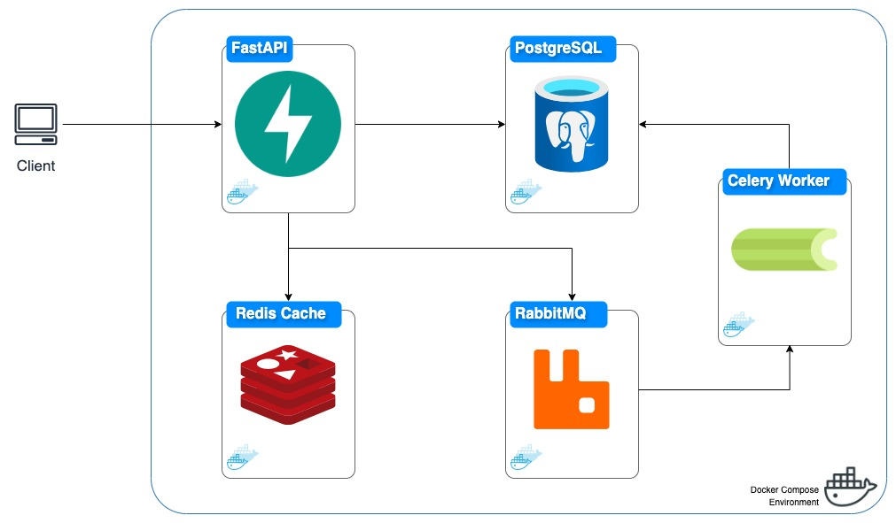

# 🚀💨🔗 Fast and Scalable URL Shortener 🚀💨🔗 <!-- omit in toc --> 


This URL shortening service is designed to be simple yet scalable, mimicking the functionality of services like [bit.ly](https://bitly.com/) or [tinyurl.com](https://tinyurl.com/app).

It allows users to convert **long URLs into shortened versions** for easier sharing and management. Emphasizing **high-performance**, **scalability**, and **concurrency**, this project adheres to modern development standards and practices, and provides a fast and reliable way to shorten URLs, manage URL redirection, and gather insights through analytics.

## Table of Contents <!-- omit in toc --> 

- [Components 🛠️](#components-️)
- [Project Setup 🏗️](#project-setup-️)
  - [Prerequisites](#prerequisites)
  - [Configuration](#configuration)
  - [Building the Service](#building-the-service)
  - [Database Migrations](#database-migrations)
  - [Starting the Service](#starting-the-service)
  - [Confirming the Setup](#confirming-the-setup)
  - [Accessing the API Documentation](#accessing-the-api-documentation)
- [Database Migrations 🗃️](#database-migrations-️)
- [Code Quality Tools 🔍](#code-quality-tools-)
  - [Simplifying Code Quality Management](#simplifying-code-quality-management)
- [Testing Approach 🧪](#testing-approach-)
- [Technical Details 🏛️](#technical-details-️)
  - [Architectural Overview of the Fast and Scalable URL Shortener](#architectural-overview-of-the-fast-and-scalable-url-shortener)
  - [Understanding the Operational Workflow](#understanding-the-operational-workflow)
    - [Exploring API through Swagger Documentation](#exploring-api-through-swagger-documentation)
    - [1. Registration and Authentication](#1-registration-and-authentication)
    - [2. Managing Your URLs](#2-managing-your-urls)
    - [3. URL Redirection and Analytics](#3-url-redirection-and-analytics)
  - [Hashing Mechanism for URL Shortening and Collision Management](#hashing-mechanism-for-url-shortening-and-collision-management)
    - [Generating Unique Short URLs](#generating-unique-short-urls)
    - [Handling Collisions](#handling-collisions)
    - [Addressing Scalability and Theoretical Limits](#addressing-scalability-and-theoretical-limits)
  - [Scalability and Performance Testing](#scalability-and-performance-testing)
    - [Recommended Stress Testing Strategy](#recommended-stress-testing-strategy)
    - [Key Metrics:](#key-metrics)

## Components 🛠️

- **FastAPI**: A modern, fast (high-performance) web framework.
- **PostgreSQL** for robust, relational database storage.
- **Redis** for caching hot URLs and reducing database load.
- **RabbitMQ** for managing background tasks like analytics updates.
- **Celery**: An asynchronous task queue/job queue based on distributed message passing.
- **SQLAlchemy**: The Python SQL toolkit and Object-Relational Mapping (ORM) library.
- **Alembic**: A lightweight database migration tool for use with SQLAlchemy.
- **Docker**: A containerization platform used to encapsulate the URL Shortener Service's components.

## Project Setup 🏗️

This guide will walk you through setting up the project using Docker and Docker Compose, ensuring a smooth start even for those new to Dockerized environments. Follow these steps to get your URL Shortener service running.

### Prerequisites

- Ensure [Docker](https://docs.docker.com/engine/install/) is installed on your machine.
- Ensure [Docker Compose](https://docs.docker.com/compose/install/) is installed.

### Configuration

1. **Environment Setup**: Before starting the service, you need to set up the environment variables:

    - Copy the sample environment file to create your own `.env` file:
      ```sh
      cp .env.example .env
      ```

    - Review the `.env` file and adjust the variables if desired (not needed). This file contains essential configurations, including database credentials and other service configurations.

### Building the Service

2. **Docker Compose Build**: Build the Docker images for the service. This step compiles the code and prepares the Docker containers.

    ```sh
    docker-compose build
    ```

### Database Migrations

3. **Running Migrations**: Set up your database schema by applying migrations. This step initializes your database with the necessary tables and relations.

    ```sh
    ./scripts/exec.sh migrate
    ```

    This command runs migrations within the Docker container, ensuring your database schema matches the application's requirements.

### Starting the Service

4. **Launch the Service**: With your environment configured and database ready, start the service:

    ```sh
    docker-compose up
    ```

    This command starts all the components of the service. The first time you run this command, Docker downloads and builds the necessary images and containers, which might take some time depending on your internet connection.

### Confirming the Setup

- **Verify the Setup**: The service is ready when the Celery worker successfully connects to RabbitMQ. Watch for the following logs to confirm the service is up and running:
    ```
    [YYYY-MM-DD HH:MM:SS,xxx: INFO/MainProcess] mingle: all alone
    [YYYY-MM-DD HH:MM:SS,xxx: INFO/MainProcess] celery@7191359b6292 ready.
    ```

    This indicates that the Celery worker is ready to process background tasks.

### Accessing the API Documentation

- **Explore API Endpoints**: With the service running, you can explore the available API endpoints and their documentation by navigating to:
  
    ```
    http://localhost:8000/docs
    ```

    This interactive documentation allows you to test API endpoints directly from your browser.

Follow these steps to ensure your URL Shortener service is configured correctly and ready to handle requests. 

## Database Migrations 🗃️

For database schema changes and versioning, **Alembic** was employed. Alembic is a lightweight database migration tool that integrates seamlessly with SQLAlchemy. Alembic allows for the generation of migration scripts based on changes in the database schema defined in the code, as well as the application of these migrations to update the database schema.

To facilitate ease of use and integration within our Dockerized environment, we provide utility scripts accessible through the project's `./scripts` directory. These scripts simplify the execution of common Alembic commands without the need to manually enter the Docker container:

**Applying Migrations**: To update your database schema to the latest version, run:

  ```sh
  ./scripts/exec.sh migrate
  ```

  This command automatically applies all pending migrations to your database, ensuring your schema is up to date with the current state of your models.

**Generating New Migrations**: When you've made changes to your models and need to generate corresponding migration scripts, use:

  ```sh
  ./scripts/exec.sh makemigrations
  ```

## Code Quality Tools 🔍

To maintain high standards of code quality, several tools are utilized to ensure the codebase remains clean, efficient, and adherent to best practices:

- **Pycln**: A formatter focused on identifying and removing unused import statements.
- **isort**: This tool automatically sorts imports alphabetically and groups them into sections.
- **flake8**: A comprehensive linting tool that helps us catch errors, enforce coding standards, and identify potential stylistic issues.
- **mypy**: A static type checker. It analyzes the code to ensure type consistency and prevent type-related errors before runtime.
- **black**: An opinionated code formatter that ensures our Python code is PEP 8 compliant. Black reformats our code in a consistent style, focusing on readability and reducing the time we spend on formatting.

### Simplifying Code Quality Management

The execution of these tools has been simplified into a single script, eliminating the need for individual commands. By executing the following command from the root directory of the project, all the aforementioned tools can be run sequentially:

```bash
./scripts/exec.sh format
```

## Testing Approach 🧪

The testing framework integrates `pytest-asyncio` for asynchronous testing, combined with `AsyncClient` from `httpx` for API request simulations. This configuration enables comprehensive testing of the service’s asynchronous operations and endpoint behaviors. To execute the test suite:

```bash
./scripts/exec.sh test
```

## Technical Details 🏛️

### Architectural Overview of the Fast and Scalable URL Shortener

This section outlines the architecture of the Fast and Scalable URL Shortener, detailing the integration of key technologies — FastAPI, PostgreSQL, Redis, RabbitMQ and Celery — within a Dockerized environment. We'll explore how these components enhance performance, manage concurrency, and efficiently handle high request volumes.

First, the following diagram provides an overview of the interconnected technologies and their contribution to the system’s efficiency and scalability.



**FastAPI Framework**

Chosen for its exemplary performance and asynchronous capabilities, FastAPI integrates Starlette for the web framework and Uvicorn as the ASGI server, offering an optimal environment for handling concurrent web requests efficiently. This setup, coupled with automatic OpenAPI documentation, streamlines the development process, enhancing the integration and developer experience. The use of Starlette and Uvicorn underpins FastAPI's ability to support high-traffic applications with ease, making it a fitting choice for the URL shortening service.

**PostgreSQL Database with AsyncSession**

PostgreSQL is selected for its durability, scalability, and adeptness with complex queries, augmented by an asynchronous plugin via SQLAlchemy's AsyncSession. This integration facilitates non-blocking database operations, critical for maintaining swift response times under heavy loads. By enabling asynchronous communication with the database, the service ensures seamless processing of web requests, thereby optimizing performance and scalability.

**Redis Caching in Asynchronous Mode**

Redis is strategically implemented as the caching layer to store and swiftly serve frequently accessed URLs, effectively reducing the demand on the database and accelerating the retrieval of popular links. Leveraging Redis in asynchronous mode aligns with the system's overarching asynchronous architecture. This approach enables non-blocking I/O operations, ensuring that the caching mechanism does not become a bottleneck, even under high loads. The asynchronous utilization of Redis enhances the system’s efficiency, allowing for immediate response delivery while concurrently processing incoming requests.

**Streamlined Asynchronous Job Handling with Celery and RabbitMQ**

To manage tasks that can be executed independently of the main request/response cycle, such as incrementing click counts, the system employs Celery, with RabbitMQ as the message broker. This decision is rooted in RabbitMQ's capacity for handling high concurrency, distinguishing it as a more suitable choice for task queuing than the single-threaded Redis, which is dedicated to caching. RabbitMQ facilitates efficient background task processing, thereby minimizing the impact on the primary server’s responsiveness and avoiding unnecessary strain on the caching system.

By segregating the task queue from the caching mechanism, the architecture ensures that Redis’s performance is optimized for what it does best: delivering fast cache responses. Meanwhile, RabbitMQ efficiently orchestrates background jobs, ensuring that these tasks do not interfere with the user experience or overload the system's resources. This separation not only preserves the speed and reliability of the caching layer but also enhances the overall scalability of the service by distributing workloads across specialized components.

### Understanding the Operational Workflow

Navigating through the operational workflow of the URL Shortener service offers a glimpse into the seamless interaction between user actions and the system's response. This journey, from user registration to URL shortening, is streamlined to enhance user experience. Below is a step-by-step guide through the standard operational flow, beginning with user interaction at our Swagger documentation.

#### Exploring API through Swagger Documentation

Start by visiting `http://localhost:8000/docs` in your web browser. This page presents the OpenAPI Swagger documentation of our service, providing a detailed overview of available endpoints, request schemas, and responses. It serves as an interactive platform where you can execute API calls directly, making it an excellent starting point for new users.

**Note**: *All requests should be prefixed with `/api/v1` to adhere to the API's design, which supports versioning and pagination.*

#### 1. Registration and Authentication

- **SignUp**: The journey begins with user registration. By utilizing the `/signup` endpoint, new users can create an account by submitting their details. This process not only registers the user but also automatically logs them in. The server utilizes both cookies and JWT tokens for session management, seamlessly handling user authentication without manual token distribution.

```http
POST /signup
```

- **Login**: For users already registered, the `/login` endpoint facilitates re-authentication. Similar to the signup process, this action also automatically logs users in, managing sessions through cookies and JWT tokens, thus eliminating the need for manual token management.

```http
POST /login
```

- **Profile Access**: Authenticated users can access their profile information using the /me endpoint. The authentication process is managed by the server, leveraging cookies and JWT tokens, ensuring that only authorized requests proceed.

```http
GET /me
```

#### 2. Managing Your URLs

Once authenticated, each user can manage their URLs through a set of endpoints designed for creating, retrieving, updating, and deleting URLs. It's important to note that all URL CRUD operations require user authentication, ensuring that users can only interact with URLs they own.

- **Creating a Shortened URL**: This endpoint allows users to create a new shortened URL. Users can optionally specify a custom alias; otherwise, an auto-generated shortened URL is provided. The response includes the details of the created URL.

```http
POST /urls
```

- **Retrieving Your URLs**: Users can list all their shortened URLs. This endpoint supports pagination and the option to include deleted URLs in the response, providing flexibility in managing large sets of URLs.

```http
GET /urls
```

- **Detailed URL Information**: For detailed information about a specific shortened URL, including its original URL and metadata, users can use this endpoint. It requires the shortened URL as a parameter. Access is restricted to the owner of the URL.

```http
GET /urls/{shortened_url}
```

- **Deleting a Shortened URL**: Delete URL: Users can delete (deactivate) a shortened URL. This endpoint performs a soft delete, marking the URL as inactive without removing its data, which allows for data integrity and potential recovery.

```http
DELETE /urls/{shortened_url}
```

**Special Features of URL Management Endpoints**

1. **Access Restricted to Owners:** Ensures that only the owner of a URL can perform CRUD operations on it, maintaining user data privacy and security.

2. **Support for Pagination and Filtering**: The endpoint for listing URLs offers pagination and the ability to include deactivated URLs in the output, facilitating the management of URLs.

3. **Custom Alias Option**: Users have the option to specify custom aliases for new URLs, providing flexibility and personalization for shortened URLs.

#### 3. URL Redirection and Analytics

Contrary to typical setups, the redirection endpoint is positioned **within** the versioned API structure under the path `/redirect/{shortened_url}`. This was an arbitrary decision to keep everything under `/api/v1`.

**Process Flow:**

- When a request to redirect a shortened URL is received, the system first attempts to retrieve the original URL from the Redis cache.

- If the original URL is not found in the cache, the service queries the PostgreSQL database to find the active URL. Upon retrieval from the database, the original URL is cached in Redis for one hour, assuming it to be a "hot URL" likely to be requested again shortly.

- The user is then redirected to the original URL, and an asynchronous task increments the click count for the URL.

**Note**: *This redirection endpoint, while a critical part of the service's functionality, is deliberately excluded from the OpenAPI documentation (`/docs`) to maintain a streamlined and user-focused API surface.*

### Hashing Mechanism for URL Shortening and Collision Management

The URL shortening service utilizes a hashing mechanism designed to efficiently generate unique short URLs and manage potential collisions, ensuring the system's scalability and reliability.

#### Generating Unique Short URLs

**SHA-256 Hashing**: Employs SHA-256 to hash the original URL along with a varying attempt number, creating a unique hash value for each attempt. This strategy mitigates the risk of collisions.

**Base62 Encoding**: Utilizes a Base62 encoding scheme, which comprises alphanumeric characters—specifically, the lowercase and uppercase letters of the alphabet (a-z, A-Z) and digits (0-9)—to encode hashed versions of the original URLs into short URLs. This selection of characters, totaling 62, effectively utilizes a character set that is widely accepted for URLs, ensuring compatibility and ease of use.

#### Handling Collisions

**Collision Detection**: The system checks for collisions by verifying the uniqueness of each generated short URL against existing entries in the database. In the rare event of a collision, the system employs a strategy of sequential attempts, where incrementing attempt numbers are appended to the input before hashing again. This process generates different hash values for each attempt, continuing until a unique short URL is produced or the predefined `MAX_RETRIES` limit is reached, effectively managing potential collisions through systematic variation.

#### Addressing Scalability and Theoretical Limits

**URL Length and Namespace**: With a default short URL length of 7 characters and Base62 encoding, the service theoretically supports 62^7 (about 3.5 trillion) unique combinations, offering a vast namespace that significantly reduces collision likelihood.

**Maximum Retries and Probability of Exhaustion**: The `MAX_RETRIES` limit is set to 10 to balance between attempt thoroughness and system performance. Given the vast namespace, the probability of exceeding this limit without finding a unique short URL is exceedingly low even under high operational volumes.

**Future Scalability Concerns**: To ensure future scalability and address the limits of the system's namespace, the service can dynamically adjust the length of shortened URLs. If it nears the namespace limit with the current settings, increasing the URL length beyond 7 characters expands the possible unique combinations, allowing the system to scale and support more unique URLs efficiently.

### Scalability and Performance Testing

In ensuring the URL Shortener Service can handle a high volume of requests and serve a vast number of users efficiently, stress testing plays a pivotal role. This section outlines the approach for conducting comprehensive stress tests to evaluate the system's performance under peak loads, ensuring scalability and reliability.

#### Recommended Stress Testing Strategy

- **Baseline Testing**: Establish a baseline by simulating normal user activity to understand the service's behavior under standard conditions.

- **Peak Load Testing**: Gradually increase the load until the system exhibits signs of stress. This includes increasing the number of concurrent users, requests per second, and data throughput, pushing the system to its operational limits.

#### Key Metrics:

- **Response Time**: Track the average, median, and 95th percentile response times as load increases.

- **Throughput**: Measure the number of requests handled per second to evaluate the system's data handling capacity.

- **Error Rate**: Monitor error rates for indications of system stress or failure points.

- **Resource Utilization**: Assess the CPU, memory, and network usage to identify potential bottlenecks.
